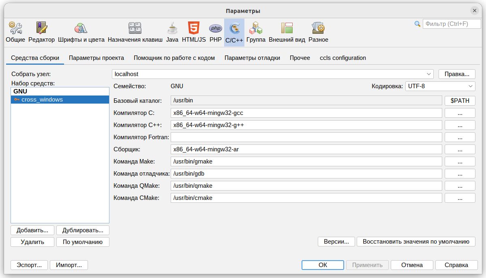
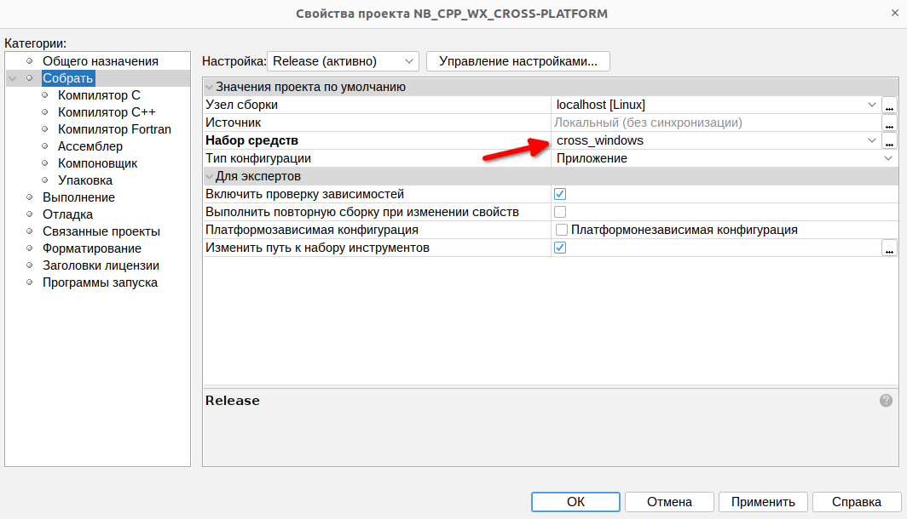
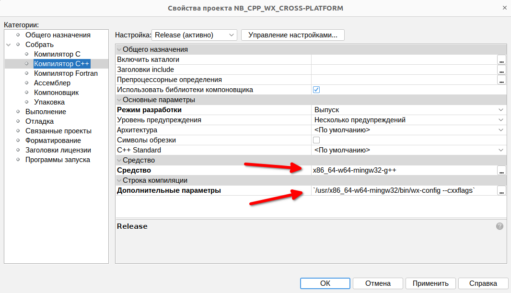
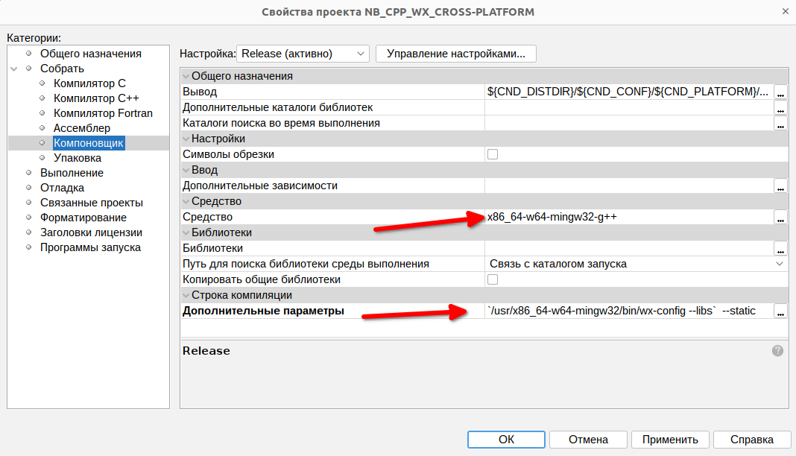
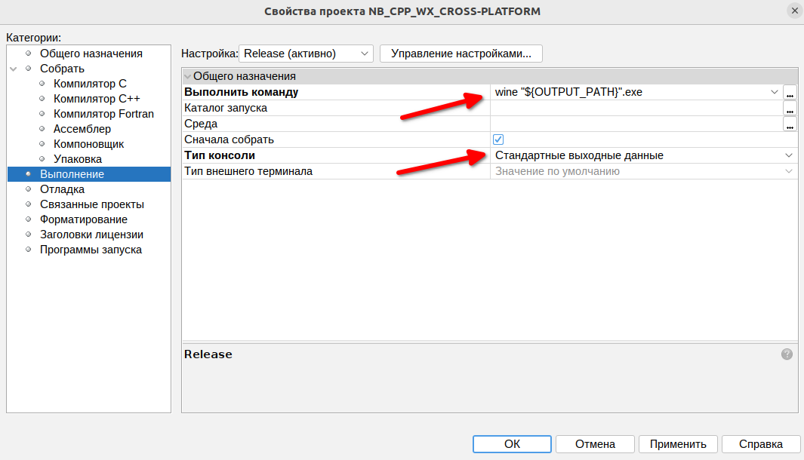
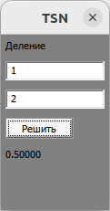

# NB_CPP_WX_CROSS-PLATFORM
Пример визуальной программы с wxWidgets на C++ в NetBeans
с использованием wxFormBuilder для Linux и кросскомпиляцией для Windows

**sudo apt install mingw-w64**











_Debug_linux/Release_linux:_
```
`/usr/local/bin/wx-config --cxxflags`
`/usr/local/bin/wx-config --libs`
```

_Debug_win64/Release_win64:_
```
`/usr/x86_64-w64-mingw32/bin/wx-config --cxxflags`
`/usr/x86_64-w64-mingw32/bin/wx-config --libs`  --static
wine "${OUTPUT_PATH}".exe
```



https://forums.wxwidgets.org/viewtopic.php?t=48620&p=208344
https://github.com/wxFormBuilder/wxFormBuilder/releases
https://github.com/wxWidgets/wxWidgets/releases
